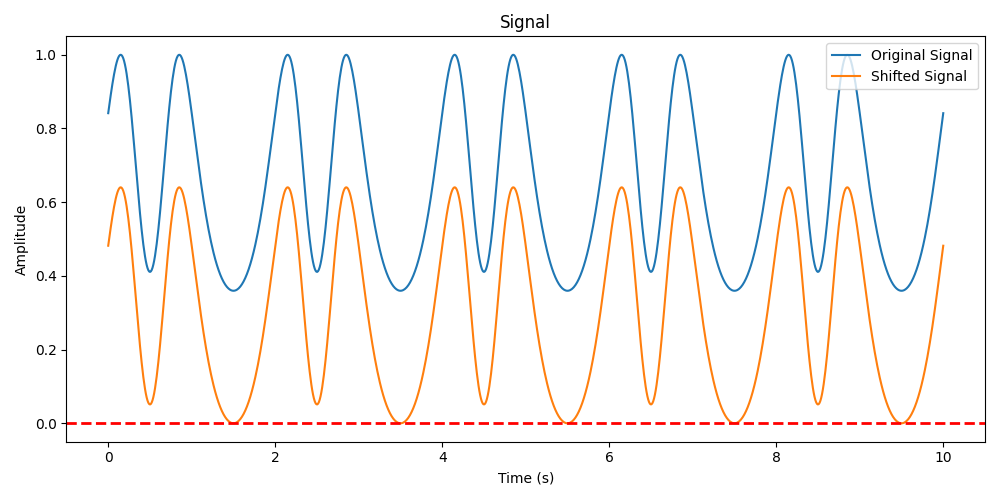

# Delta Min Preprocessor

The *delta min preprocessor* function shifts the input signal by the max of the signal. The is defined as:

$$
x_{shifted_{i}} = x_{i} - \min({x}), \quad \forall i \in \{1, \dots, N\}
$$

For shifting signals by a custom $\delta$, see the [`delta preprocessor`](../functional/delta_preprocessor_fn.md) function. For more on how we compute the min of a signal, check out [`min`](../../functional/min.md) function.

::: autofeat.preprocess.functional.delta_min_tf

## Examples

### Transform Signal

```python
import numpy as np
import autofeat.preprocess.functional as PF

# Create a random signal
time = np.linspace(0, 10, 1000)
frequency = 500  # Frequency of the signal in Hz
signal = np.sin(np.exp(np.sin(2 * np.pi * frequency * time)))

# Shift the signal by the minimum value
shifted_signal = PF.delta_min_tf(signal)
```

### Visualize Transform

```python
import matplotlib.pyplot as plt

# Plot the original signal and the shifted signal
fig, ax = plt.subplots(figsize=(10, 5))
ax.plot(time, signal, label='Original Signal')
ax.plot(time, shifted_signal, label='Shifted Signal')
ax.axhline(y=0, color='red', linestyle='--', linewidth=2)
ax.set_xlabel('Time (s)')
ax.set_ylabel('Amplitude')
ax.set_title('Signal')
ax.legend()
plt.tight_layout()
plt.show()
```

This can be seen in the figure below.




If you enjoy using [`AutoFeat`](../../../index.md), please consider starring the [repository](https://github.com/autonlab/AutoFeat) ⭐️.