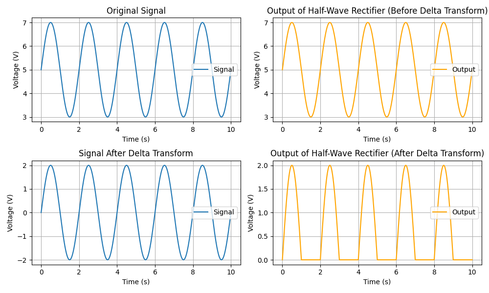

# Delta Preprocessor

The *delta preprocessor* function shifts the input signal by a fixed amount. The is defined as:

$$
x_{shifted_{i}} = x_{i} - \delta, \quad \forall i \in \{1, \dots, N\}, \quad \delta \in \mathbb{R}
$$

::: autofeat.preprocess.functional.delta_tf

## Examples

Consider a system that feeds in to a half-wave rectifier. Half-wave rectifiers are used to remove the negative portion of a signal and are use in many applications such as power supplies and AM radios. The half-wave rectifier is defined as:

$$
y_{i} = \max(x_{i}, 0) = 
\begin{cases}
x_{i}, & \text{if } x_{i} \geq 0 \\
0, & \text{if } x_{i} < 0
\end{cases} , \quad \forall i \in \{1, \dots, N\}
$$

where $x_{i}$ represents an element of the input signal, $y_{i}$ represents an element of the output signal, and $N$ is the number of elements in the signal. 

Suppose we want to apply the half-wave rectifer to just the AC part of a signal containing both AC and DC components, we can use the *delta preprocessor* function to eliminate the DC component.

### Define Signal, HWR System, and Preprocessor

Define a signal with the following parameters:

$$
signal_{i} = DC_{offset} + AC_{amp} \cdot \sin(2 \pi \cdot freq \cdot time_{i})
$$

$DC_{offset} = 5$ V

$AC_{amp} = 2$ V

$freq = 500$ Hz

$N = 1000$ samples

$T = 10$ s

```python
import numpy as np
import autofeat.preprocess.functional as PF

# Define signal
time = np.linspace(0, 10, 1000) # secs
freq = 500                      # Hz
dc_offset = 5                   # V
ac_amp = 2                      # V

signal = dc_offset + ac_amp * np.sin(2 * np.pi * freq * time)

# Define half-wave rectifier
half_wave_rectifier = lambda x_i: np.maximum(x_i, 0)
```

### Transform Signal

Transform the signal by the delta transform preprocessor and apply the half-wave rectifier. This will remove the DC component by setting $\delta = DC_{offset} = 5$ V.

```python
delta = dc_offset # Amount to shift by

# Preprocess signal
signal_transformed = PF.delta_tf(signal, delta=delta)

# Apply half-wave rectifier
system_output = half_wave_rectifier(signal_transformed)
```

### Visualize Transform

Visualize the signal, the transformed signal, and the output of the half-wave rectifier with and without the delta transform preprocessor.

```python
import matplotlib.pyplot as plt

# Plot results
fig, (ax1, ax2) = plt.subplots(2, 2, figsize=(10, 6))

# Plot signal and output of half-wave rectifier (before delta transform)
ax1[0].plot(time, signal, label='Signal')
ax1[0].set_xlabel('Time (s)')
ax1[0].set_ylabel('Voltage (V)')
ax1[0].set_title('Original Signal')
ax1[0].grid(True)
ax1[0].legend()

ax1[1].plot(time, half_wave_rectifier(signal), color='orange', label='Output')
ax1[1].set_xlabel('Time (s)')
ax1[1].set_ylabel('Voltage (V)')
ax1[1].set_title('Output of Half-Wave Rectifier (Before Preprocessing)')
ax1[1].grid(True)
ax1[1].legend()

# Plot signal and output of half-wave rectifier (after delta transform)
ax2[0].plot(time, signal_transformed, label='Signal')
ax2[0].set_xlabel('Time (s)')
ax2[0].set_ylabel('Voltage (V)')
ax2[0].set_title('Signal After Delta Transform')
ax2[0].grid(True)
ax2[0].legend()

ax2[1].plot(time, system_output, color='orange', label='Output')
ax2[1].set_xlabel('Time (s)')
ax2[1].set_ylabel('Voltage (V)')
ax2[1].set_title('Output of Half-Wave Rectifier (After Preprocessing)')
ax2[1].grid(True)
ax2[1].legend()

plt.tight_layout()
plt.show()
```

We can observe how with the help of the *delta preprocessor* function, shifting the signal by the DC offset of the signal eliminates the DC component of the signal and allows the half-wave rectifier to only act on the AC component of the signal.



### Fun Fact

Half-wave rectifiers are equivalent to a [rectified linear unit](https://www.cs.toronto.edu/~fritz/absps/reluICML.pdf) i.e. the $ReLU$ activation function used in neural networks.


If you enjoy using [`AutoFeat`](../../../index.md), please consider starring the [repository](https://github.com/autonlab/AutoFeat) ⭐️.