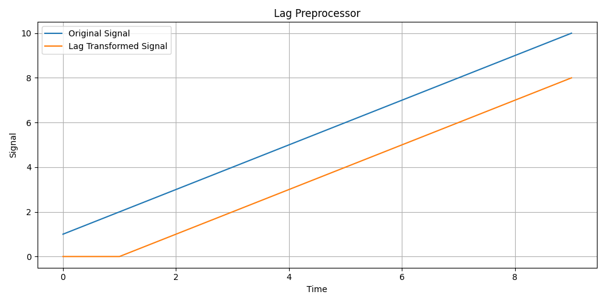

<!-- 
MIT License

Copyright (c) 2023 Carnegie Mellon University, Auton Lab

Permission is hereby granted, free of charge, to any person obtaining a copy
of this software and associated documentation files (the "Software"), to deal
in the Software without restriction, including without limitation the rights
to use, copy, modify, merge, publish, distribute, sublicense, and/or sell
copies of the Software, and to permit persons to whom the Software is
furnished to do so, subject to the following conditions:

The above copyright notice and this permission notice shall be included in all
copies or substantial portions of the Software.

THE SOFTWARE IS PROVIDED "AS IS", WITHOUT WARRANTY OF ANY KIND, EXPRESS OR
IMPLIED, INCLUDING BUT NOT LIMITED TO THE WARRANTIES OF MERCHANTABILITY,
FITNESS FOR A PARTICULAR PURPOSE AND NONINFRINGEMENT. IN NO EVENT SHALL THE
AUTHORS OR COPYRIGHT HOLDERS BE LIABLE FOR ANY CLAIM, DAMAGES OR OTHER
LIABILITY, WHETHER IN AN ACTION OF CONTRACT, TORT OR OTHERWISE, ARISING FROM,
OUT OF OR IN CONNECTION WITH THE SOFTWARE OR THE USE OR OTHER DEALINGS IN THE
SOFTWARE.
-->

# Lag Preprocessor

This preprocessor computes the *lag transform* of the input signal. This is shifts the signal elements by some an integer value to a new index. The lag transform is defined as:

$$
x_{t, \tau} = x_{t - \tau}
$$

where $x_{t, \tau}$ is the lag transform of $x_t$ by some integer amount $\tau$.

**The lag transform is useful for:**

> - Identifying periodicity in the signal.
> - Identifying trends in the signal.


## Limitations

> - When the signal is lagged, the first $\tau$ elements are set to `np.nan` values. This is because the lag transform is undefined for these elements. Therefore, when being used the user must ensure that these values are handled appropriately.
> - Only arrays of `floats` are supported. If passed an array of another type, it will be cast to `float`. If this fails, the function will raise an exception.

::: autonfeat.preprocess.transform.LagPreprocessor

## Examples

Consider the following discrete 1D signal:

$$
x = [1, 2, 3, 4, 5, 6, 7, 8, 9, 10]
$$


### Transform Signal

```python
import numpy as np
import autonfeat as aft

# Define signal
num_samples = 10
signal = np.arange(1, num_samples + 1)

lag = 2

# Preprocess and transform signal
transformed_signal = preprocessor(signal, lag=lag)
```

### Visualize Transform

We then visualize the signal and the transformed signal. The transformed signal is shifted by some integer amount $\tau = 2$. For visualization, we convert any `np.nan` values to `0`.


```python
import matplotlib.pyplot as plt

transformed_signal = np.nan_to_num(transformed_signal)

# Plot results
fig, ax = plt.subplots(1, 1, figsize=(10, 5))
ax.plot(signal, label='Original Signal')
ax.plot(transformed_signal, label='Lag Transformed Signal')
ax.set_xlabel('Time')
ax.set_ylabel('Signal')
ax.set_title('Lag Preprocessor')
ax.legend()
ax.grid()
plt.show()
```




If you enjoy using [`AutonFeat`](../../../index.md), please consider starring the [repository](https://github.com/autonlab/AutonFeat) ⭐️.