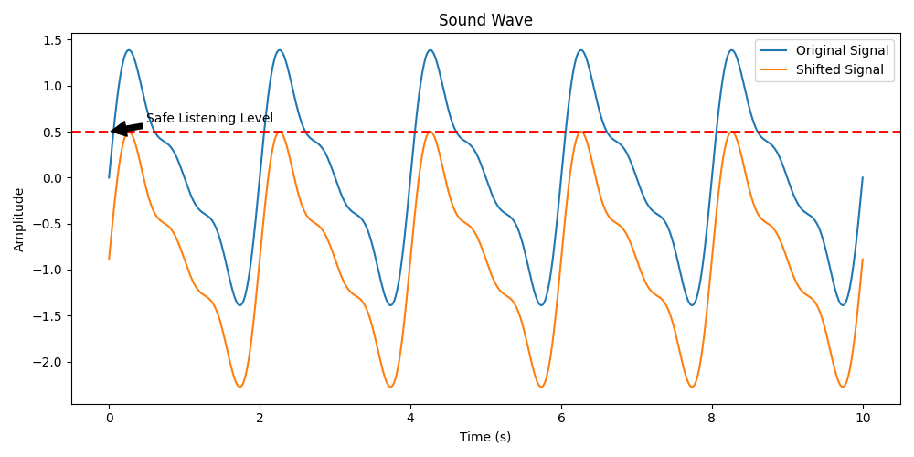

# Delta Max Preprocessor Transform

The *Delta Max Preprocessor Transform* shifts the input signal by the max of the signal. The is defined as:

$$
x_{shifted_{i}} = x_{i} - \max({x}), \quad \forall i \in \{1, \dots, N\}
$$

For shifting signals by a custom $\delta$, see the [`Delta Transform Preprocessor`](delta_preprocessor.md). For more on how we compute the max of a signal, check out [`max`](../../functional/max.md) function.

::: autonfeat.preprocess.transform.DeltaMaxPreprocessor

## Examples

Consider the following example. We generate a sound wave with a frequencey of 500Hz. The sound wave may contain magnitudes that are not safe for the human ear. We can apply the delta max transform to shift the signal such that it falls within a safe range.

### Transform Signal

```python
import numpy as np
import autonfeat as aft

# Create a random signal
time = np.linspace(0, 10, 1000)
frequency = 500  # Frequency of the signal in Hz
sound_wave = np.sin(2 * np.pi * frequency * time) + 0.5 * np.sin(2 * np.pi * 2 * frequency * time) + 0.25 * np.sin(2 * np.pi * 3 * frequency * time)

# Create Preprocessor
preprocessor = aft.preprocess.DeltaMaxPreprocessor()

# Shift the sound wave by the peak value to ensure safe listening levels
# if we define a safe listening level as 0.5
safe_level = 0.5
safe_sound = preprocessor(sound_wave) + safe_level
```

### Visualize Transform

```python
import matplotlib.pyplot as plt

# Plot the original signal and the shifted signal
fig, ax = plt.subplots(figsize=(10, 5))
ax.plot(time, sound_wave, label='Original Signal')
ax.plot(time, safe_sound, label='Shifted Signal')
ax.axhline(y=safe_level, color='red', linestyle='--', linewidth=2)
ax.annotate('Safe Listening Level', xy=(0, safe_level), xytext=(0.5, safe_level + 0.1), arrowprops=dict(facecolor='black', shrink=0.05))
ax.set_xlabel('Time (s)')
ax.set_ylabel('Amplitude')
ax.set_title('Sound Wave')
ax.legend()
plt.tight_layout()
plt.show()
```

This can be seen in the figure below.



If you enjoy using [`AutonFeat`](../../../index.md), please consider starring the [repository](https://github.com/autonlab/AutonFeat) ⭐️.