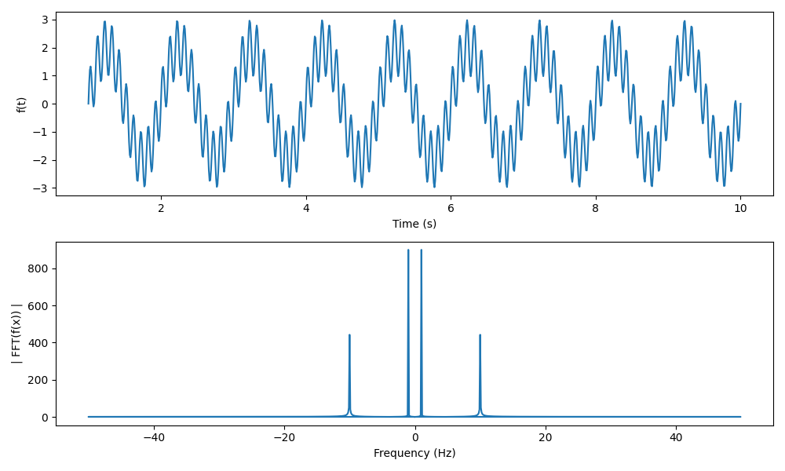

# Discrete Fourier Transform Preprocessor

This computes the *1D discrete Fourier transform* (DFT) of the input signal. The Fourier transform is efficiently computed using the fast Fourier transform algorithm utilizing symmetries in the computed terms. The algorithm is fastest for 2 powers of $N$ i.e. $2^{N}$. See [numpy.fft.fft](https://numpy.org/doc/stable/reference/generated/numpy.fft.fft.html) for more details. The 1D DFT is defined as:

$$
X_k = \sum_{n=0}^{N-1} x_n e^{-2\pi i k n / N}, \quad k = 0, \ldots, N-1.
$$

where $N$ is the number of samples and $k$ is the frequency index.

## Limitations

> - The input signal must be real-valued.
> - The transform is sensitive to noise and outliers.

::: autonfeat.preprocess.transform.DFTPreprocessor

## Examples

We define as signal as $f(t) = 2 \sin(2 \pi t) + \sin(10 \cdot 2 \pi t)$ for $t \in [1, 10]$ with a sampling rate of 100 samples per second. The signal is then transformed using the DFT preprocessor.

### Transform Signal

```python
import numpy as np
import autonfeat as aft

start_time = 1  # Start time in seconds
end_time = 10    # End time in seconds
sampling_rate = 100  # Number of samples per second
num_samples = int((end_time - start_time) * sampling_rate)

# Signal = 2 x sin(2 x pi x t) + sin(10 x 2 x pi x t)
time = np.linspace(start_time, end_time, num_samples)
signal = 2 * np.sin(2 * np.pi * time) + np.sin(10 * 2 * np.pi * time)

# Create Preprocessor
preprocessor = aft.preprocess.DFTPreprocessor()

# Preprocess and transform signal
transformed_signal = preprocessor(signal)
```

### Visualize Transform

We then visualize the signal and its Fourier transform. The signal in the frequency domain may be able to identify important features in the signal that were otherwise not visible in the time domain.

```python
import matplotlib.pyplot as plt

# Plot results
fig, (ax1, ax2) = plt.subplots(2, 1, figsize=(10, 6))

ax1.plot(time, signal)
ax1.set_xlabel("Time (s)")
ax1.set_ylabel("f(t)")

ax2.plot(
    np.fft.fftfreq(num_samples, 1 / sampling_rate), 
    np.abs(transformed_signal)
)
ax2.set_xlabel("Frequency (Hz)")
ax2.set_ylabel("| FFT(f(x)) |")

plt.tight_layout()
plt.show()
```




If you enjoy using [`AutonFeat`](../../../index.md), please consider starring the [repository](https://github.com/autonlab/AutonFeat) ⭐️.